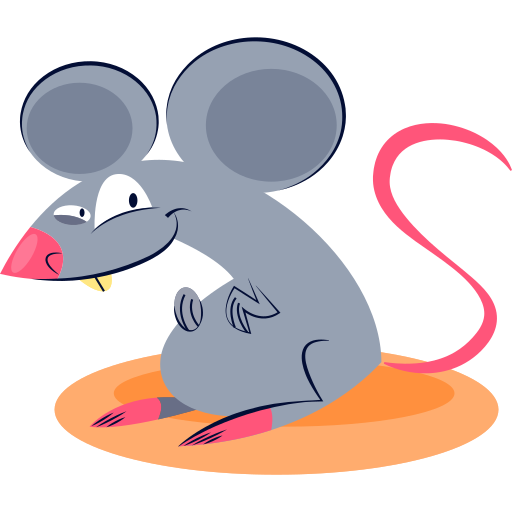

<h1 align="left">Leptospirose</h1>

Site responsivo desenvolvido para um trabalho interdisciplinar de Programação Web 3 e Biologia, com o objetivo de apresentar a pesquisa realizada sobre a <b>Leptospirose</b>.

 

## 👨‍💻 Tecnologias utilizadas

 
 
 

 

## 🔗 Link do site

‣ https://leohsantos.github.io/siteLeptospirose/